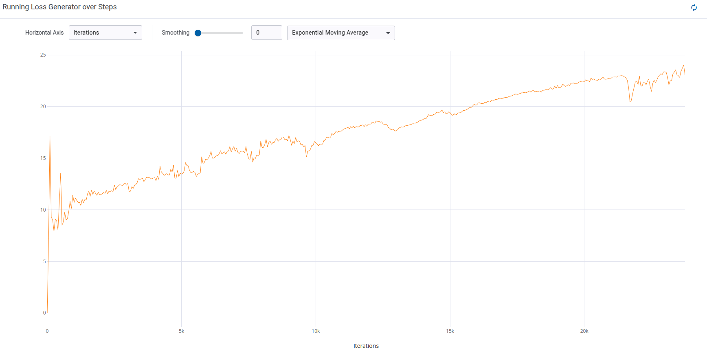
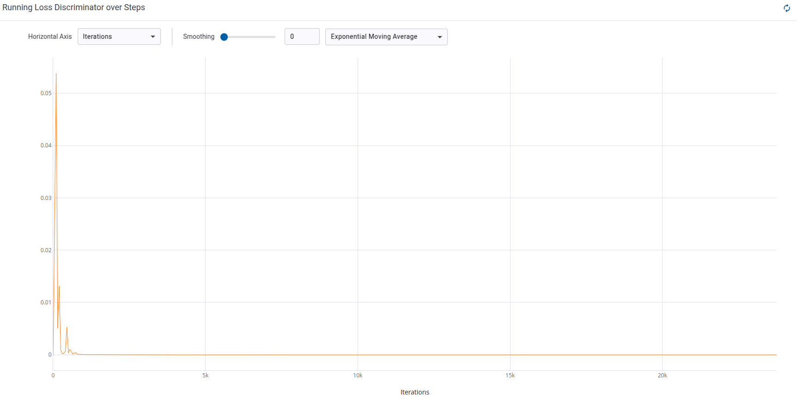

# ДЗ 2. Имплементация GAN
Выполнила Горохова Александра Сергеевна, группа M4150

## Окружение
```bash
git clone https://github.com/TimDettmers/bitsandbytes.git
```

Создайте окружение в anaconda3:
```bash
conda env create -f environment.yml
conda activate genmodels
```

## Структура проекта 
- `./code/models/cspup.py` - имплементация CSPup блока
- `./code/models/generator.py` - имплементация генератора
- `./code/models/discriminator.py` - дискриминатор
- `./code/logger.py` - логирование clearml
- `./code/utils.py` - полезыне функции
- `./code/init_funcs.py` - инициализация всего
- `./code/trainer.py` - класс для обучения
`- ./code/train.py` - главный скрипт обучения


## Реализация CSPup блока
```python
class CSPUp(nn.Module):
    def __init__(self, in_channels):
        super(CSPUp, self).__init__()

        self.upsample = nn.Upsample(scale_factor=2, mode='bilinear', align_corners=True)

        hidden_channels = in_channels // 2
        self.conv1 = nn.Conv2d(in_channels, hidden_channels, kernel_size=1, stride=1, padding=0, bias=False)

        self.short_branch = nn.Sequential(
            nn.ConvTranspose2d(hidden_channels, hidden_channels, kernel_size=4, stride=2, padding=1),
            nn.ReLU(True),
        )

        self.long_branch = nn.Sequential(
            nn.Conv2d(hidden_channels, hidden_channels, kernel_size=1, stride=1, padding=0),
            nn.ReLU(inplace=True),
            nn.ConvTranspose2d(hidden_channels, hidden_channels, kernel_size=4, stride=2, padding=1),
            nn.Conv2d(hidden_channels, hidden_channels, kernel_size=3, stride=1, padding=1),
            nn.ReLU(inplace=True),
            nn.Conv2d(hidden_channels, hidden_channels, kernel_size=3, stride=1, padding=1),
        )

    def forward(self, x):
        c_half = x.shape[1] // 2
        x1 = x[:, :c_half, :, :]
        x2 = x[:, c_half:, :, :]
        x1 = self.short_branch(x1)
        x2 = self.long_branch(x2)
        return x1 + x2

```

## Реализация генератора

```python
class Generator(nn.Module):
    def __init__(self, z_dim=100):
        super(Generator, self).__init__()
        self.cspup1 = CSPUp(z_dim)
        self.cspup2 = CSPUp(z_dim//2)
        self.cspup3 = CSPUp(z_dim//4)
        self.cspup4 = CSPUp(z_dim//8)

        self.final = nn.Sequential(
            nn.ConvTranspose2d(64, 3, kernel_size=4, stride=2, padding=1),
            nn.ReLU(inplace=True)
        )
        
    def forward(self, z):
        x = self.cspup1(z)
        x = self.cspup2(x)
        x = self.cspup3(x)
        x = self.cspup4(x)

        x = self.final(x)
        return x
```

## Обучение
Чтобы запустить обучение, выполните скрипт:
```bash
bash scripts/train.sh
```

Все параметры генератора и дискриминатора задаются в hydra конфиге обучения. Кофиги нужно располагать строго в папке `./configs/`.

Пример конфига:

```yaml
project_name: 'gan'
exp_name: 'gan2'
outdir: './hw2/experiments/'
logdir: './hw2/logs/'

generator:
  _target_: models.generator.Generator
  z_dim: 1024

discriminator:
  _target_: models.discriminator.Discriminator

train:
  optimizer_G:
    _target_: torch.optim.AdamW
    lr:  0.0002
    betas: [0.5, 0.999]
    fused: True
    weight_decay: 0.02
  optimizer_D:
    _target_: torch.optim.Adam
    lr:  0.0002
    betas: [0.5, 0.999]

  n_epoch: 100
  freq_vis: 50
  sample_interval: 300
  save_interval: 30
  activation: 'None'
  use_amp: True
  loss:
    _target_: torch.nn.BCELoss
  save_dir: './hw2/dumps/'

augmentation:
  resize:
    _target_: torchvision.transforms.Resize
    size: 128
  center_crop:
    _target_: torchvision.transforms.CenterCrop
    size: 128
  to_tensor:
    _target_: torchvision.transforms.ToTensor
  normalize:
    _target_: torchvision.transforms.Normalize
    mean: [0.5]
    std: [0.5]

dataset:
  batch_size: 256
  num_workers: 16
  h: 128
  w: 128

  seed: 13

```

Логирование экспериментов произзводится в clearml.

Я запустила обучение реализованного GAN с упомянутым выше конфигом, однако сходимости не получилось - лосс генератора довольно резко возрастал, пока лосс дискриминатора оставался в пределах 1e-3. Это свидетельствует о том, что дискриминатор слишком сильный, либо генератор слишком слабый.

<p>

</p>
График лосса генератора

<p></p>
<p>

</p>
График лосса дискриминатора