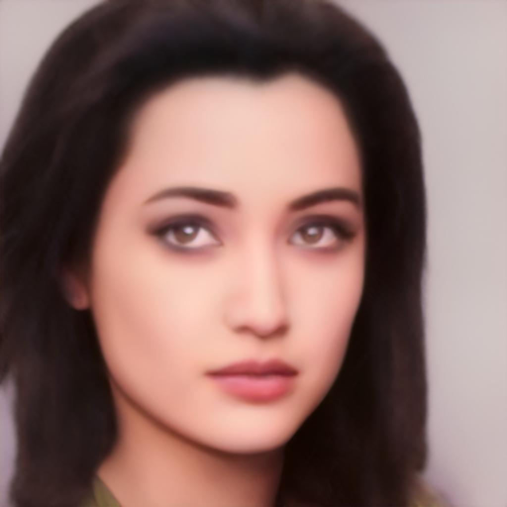
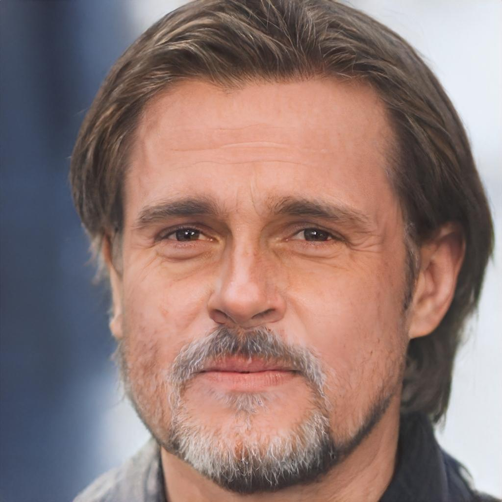

# ДЗ 4. Sampling в латентном пространстве StyleGAN
Выполнила Горохова Александра

## Окружение
Сначала скачайте все необходимые репозитории и веса моделей:
```bash
bash download.sh
```

Затем создайте окружение:
```bash
python -m venv genmodels_env
source genmodels_env/bin/activate
pip install -r requirements.txt
```

Теперь вы готовы к работе.

## Подгототовительный этап

Изображения выбранных знаменитостей находятся в папке `./data/celebs`

<p>


</p>
<p>


</p>
<p>


</p><p>


</p>
Таблица 1. Выбранные знаменитости

### Alighn images
Далее изображения были кадрированы, результат лежит в папке `./data/aligned_images/`

<p>


</p>
<p>


</p>
<p>


</p><p>


</p>
Таблица 2. Кадрированные изображения знаменитостей

### Поиск проекции в пространстве StyleGAN
Тут мне было интересно попробовать несколько подходов.

Сначала пробовала искать с помощью среднего вектора - добавила в пайплайн бейзлайна scheduler и early_stopping, а также поменяла вес lpips_weight на 1.2 , чтобы больше оригинальных черт сохранялось. Потом сделала то же самое с энкодером.

- `mean vector exp2` - добавила в пайплайн бейзлайна scheduler и early_stopping + поменяла lpips_weight на 1.2
- `encoder exp1` - то же самое с encoder


| exp      | joly | pitt | watson | merphy | 
|----------|----------|----------|----------|----------|
| `orig`|  |  |  |  |
| `mean vector exp2`|  |  |  |  |
| `encoder exp1`|  |  |  |  |

Таблица 3. Сравнение проекции с помощью среднего вектора и с поомщью энкодера

По результатам можно сказать, что метод с энкодером показал себя лучше - проекции больше похожи на изнчалльные изображения, меньше размытостей и артефактов.

## Style transfer

Для переноса стилей выбрала три картинки и тоже кадрировала их - оригиналы лежат в `./data/styles_imgs/`, кадрированные - в `./aligned_style_images/`

<p>


</p>
Таблица 4. Кадрированные изображения стилей


Далее сделала перенос стиля, выбрала параметр `alpha=0.4`, чтобы сохранить больше черт оригинального изображения

<table style="border-collapse: collapse; width: 100%;">
    <thead>
        <tr>
            <th style="width: 20%; border: 1px solid #ddd; padding: 8px;"></th>
            <th style="width: 20%; border: 1px solid #ddd; padding: 8px; text-align: center;">Angelina Joly</th>
            <th style="width: 20%; border: 1px solid #ddd; padding: 8px; text-align: center;">Brad Pitt</th>
            <th style="width: 20%; border: 1px solid #ddd; padding: 8px; text-align: center;">Emma Watson</th>
            <th style="width: 20%; border: 1px solid #ddd; padding: 8px; text-align: center;">Merphy</th>
        </tr>
    </thead>
    <tbody>
        <tr>
            <th style="border: 1px solid #ddd; padding: 8px; text-align: center; vertical-align: middle;">
                <!-- <strong>Arcane Style</strong><br>
                 -->
            </th>
            <td style="border: 1px solid #ddd; padding: 8px; text-align: center;">
                
            </td>
            <td style="border: 1px solid #ddd; padding: 8px; text-align: center;">
                
            </td>
            <td style="border: 1px solid #ddd; padding: 8px; text-align: center;">
                
            </td>
            <td style="border: 1px solid #ddd; padding: 8px; text-align: center;">
                
            </td>
        </tr>
        <tr>
            <td style="border: 1px solid #ddd; padding: 8px; text-align: center; vertical-align: middle;">
                <strong>Arcane Style</strong><br>
                
            </td>
            <td style="border: 1px solid #ddd; padding: 8px; text-align: center;">
                
            </td>
            <td style="border: 1px solid #ddd; padding: 8px; text-align: center;">
                
            </td>
            <td style="border: 1px solid #ddd; padding: 8px; text-align: center;">
                
            </td>
            <td style="border: 1px solid #ddd; padding: 8px; text-align: center;">
                
            </td>
        </tr>
        <tr>
            <td style="border: 1px solid #ddd; padding: 8px; text-align: center; vertical-align: middle;">
                <strong>Pop Art Style</strong><br>
                
            </td>
            <td style="border: 1px solid #ddd; padding: 8px; text-align: center;">
                
            </td>
            <td style="border: 1px solid #ddd; padding: 8px; text-align: center;">
                
            </td>
            <td style="border: 1px solid #ddd; padding: 8px; text-align: center;">
                
            </td>
            <td style="border: 1px solid #ddd; padding: 8px; text-align: center;">
                
            </td>
        </tr>
        <tr>
            <td style="border: 1px solid #ddd; padding: 8px; text-align: center; vertical-align: middle;">
                <strong>Nuar Style</strong><br>
                
            </td>
            <td style="border: 1px solid #ddd; padding: 8px; text-align: center;">
                
            </td>
            <td style="border: 1px solid #ddd; padding: 8px; text-align: center;">
                
            </td>
            <td style="border: 1px solid #ddd; padding: 8px; text-align: center;">
                
            </td>
            <td style="border: 1px solid #ddd; padding: 8px; text-align: center;">
                
            </td>
        </tr>
    </tbody>
</table>

Таблица 5. Результат переноса стиля

Немного все же изменились позы, но узнаваемые черты остались, так же поменялся цвет изображений, где-то подкрасились губы или немного поменялись волосы.

## Expression transfer

Для переноса эмоций я взяла `psi=3`, чтобы эмоция была сильно заметна, и `indices=[4,5,6]` - то есть средние векторы, которые должны были соответсоввать выражению лица.

<table style="border-collapse: collapse; width: 100%; font-family: Arial, sans-serif;">
    <thead>
        <tr>
            <th style="width: 20%; border: 1px solid #e0e0e0; padding: 12px; "></th>
            <th style="width: 20%; border: 1px solid #e0e0e0; padding: 12px;  text-align: center;">Angelina Joly</th>
            <th style="width: 20%; border: 1px solid #e0e0e0; padding: 12px;  text-align: center;">Brad Pitt</th>
            <th style="width: 20%; border: 1px solid #e0e0e0; padding: 12px;  text-align: center;">Emma Watson</th>
            <th style="width: 20%; border: 1px solid #e0e0e0; padding: 12px;  text-align: center;">Merphy</th>
        </tr>
    </thead>
    <tbody>
        <tr>
            <td style="border: 1px solid #e0e0e0; padding: 12px; text-align: center; vertical-align: middle; ">
                <strong>Original Images</strong>
            </td>
            <td style="border: 1px solid #e0e0e0; padding: 12px; text-align: center;">
                
            </td>
            <td style="border: 1px solid #e0e0e0; padding: 12px; text-align: center;">
                
            </td>
            <td style="border: 1px solid #e0e0e0; padding: 12px; text-align: center;">
                
            </td>
            <td style="border: 1px solid #e0e0e0; padding: 12px; text-align: center;">
                
            </td>
        </tr>
        <tr>
            <td style="border: 1px solid #e0e0e0; padding: 12px; text-align: center; vertical-align: middle; ">
                <strong>Smile Transfer</strong><br>
            </td>
            <td style="border: 1px solid #e0e0e0; padding: 12px; text-align: center;">
                
            </td>
            <td style="border: 1px solid #e0e0e0; padding: 12px; text-align: center;">
                
            </td>
            <td style="border: 1px solid #e0e0e0; padding: 12px; text-align: center;">
                
            </td>
            <td style="border: 1px solid #e0e0e0; padding: 12px; text-align: center;">
                
            </td>
        </tr>
        <tr>
            <td style="border: 1px solid #e0e0e0; padding: 12px; text-align: center; vertical-align: middle; ">
                <strong>Pose Transfer</strong><br>
            </td>
            <td style="border: 1px solid #e0e0e0; padding: 12px; text-align: center;">
                
            </td>
            <td style="border: 1px solid #e0e0e0; padding: 12px; text-align: center;">
                
            </td>
            <td style="border: 1px solid #e0e0e0; padding: 12px; text-align: center;">
                
            </td>
            <td style="border: 1px solid #e0e0e0; padding: 12px; text-align: center;">
                
            </td>
        </tr>
        <tr>
            <td style="border: 1px solid #e0e0e0; padding: 12px; text-align: center; vertical-align: middle; ">
                <strong>Age Transfer</strong><br>
            </td>
            <td style="border: 1px solid #e0e0e0; padding: 12px; text-align: center;">
                
            </td>
            <td style="border: 1px solid #e0e0e0; padding: 12px; text-align: center;">
                
            </td>
            <td style="border: 1px solid #e0e0e0; padding: 12px; text-align: center;">
                
            </td>
            <td style="border: 1px solid #e0e0e0; padding: 12px; text-align: center;">
                
            </td>
        </tr>
    </tbody>
</table>

Таблица 6. Результат переноса эмоции

Оригинальные черты заметны, у кого-то меньше удалось перенести эмоцию, возможно из-за слабости самой эмоции по сравнению с распределением лица знаменитости. Поза не изменилась, артефактов не обнаружено.

## Face Swap

Для перемены лиц я взяла `identity_weight=5.0`, чтобы в большей степени перенести чужое лицо.

<table style="border-collapse: collapse; width: 100%; font-family: Arial, sans-serif;">
    <thead>
        <tr>
            <th style="width: 20%; border: 1px solid #e0e0e0; padding: 12px; "></th>
            <th style="width: 20%; border: 1px solid #e0e0e0; padding: 12px;  text-align: center;">Angelina Joly</th>
            <th style="width: 20%; border: 1px solid #e0e0e0; padding: 12px;  text-align: center;">Brad Pitt</th>
            <th style="width: 20%; border: 1px solid #e0e0e0; padding: 12px;  text-align: center;">Emma Watson</th>
            <th style="width: 20%; border: 1px solid #e0e0e0; padding: 12px;  text-align: center;">Merphy</th>
        </tr>
    </thead>
    <tbody>
        <tr>
            <td style="border: 1px solid #e0e0e0; padding: 12px; text-align: center; vertical-align: middle; ">
                <strong>Original Images</strong>
            </td>
            <td style="border: 1px solid #e0e0e0; padding: 12px; text-align: center;">
                
            </td>
            <td style="border: 1px solid #e0e0e0; padding: 12px; text-align: center;">
                
            </td>
            <td style="border: 1px solid #e0e0e0; padding: 12px; text-align: center;">
                
            </td>
            <td style="border: 1px solid #e0e0e0; padding: 12px; text-align: center;">
                
            </td>
        </tr>
        <tr>
            <td style="border: 1px solid #e0e0e0; padding: 12px; text-align: center; vertical-align: middle; ">
                
            </td>
            <td style="border: 1px solid #e0e0e0; padding: 12px; text-align: center;">
                <!--  -->
            </td>
            <td style="border: 1px solid #e0e0e0; padding: 12px; text-align: center;">
                
            </td>
            <td style="border: 1px solid #e0e0e0; padding: 12px; text-align: center;">
                
            </td>
            <td style="border: 1px solid #e0e0e0; padding: 12px; text-align: center;">
                
            </td>
        </tr>
        <tr>
            <td style="border: 1px solid #e0e0e0; padding: 12px; text-align: center; vertical-align: middle; ">
                
            </td>
            <td style="border: 1px solid #e0e0e0; padding: 12px; text-align: center;">
                
            </td>
            <td style="border: 1px solid #e0e0e0; padding: 12px; text-align: center;">
                <!--  -->
            </td>
            <td style="border: 1px solid #e0e0e0; padding: 12px; text-align: center;">
                
            </td>
            <td style="border: 1px solid #e0e0e0; padding: 12px; text-align: center;">
                
            </td>
        </tr>
        <tr>
            <td style="border: 1px solid #e0e0e0; padding: 12px; text-align: center; vertical-align: middle; ">
                
            </td>
            <td style="border: 1px solid #e0e0e0; padding: 12px; text-align: center;">
                
            </td>
            <td style="border: 1px solid #e0e0e0; padding: 12px; text-align: center;">
                
            </td>
            <td style="border: 1px solid #e0e0e0; padding: 12px; text-align: center;">
                <!--  -->
            </td>
            <td style="border: 1px solid #e0e0e0; padding: 12px; text-align: center;">
                
            </td>
        </tr>
        <tr>
            <td style="border: 1px solid #e0e0e0; padding: 12px; text-align: center; vertical-align: middle; ">
                
            </td>
            <td style="border: 1px solid #e0e0e0; padding: 12px; text-align: center;">
                
            </td>
            <td style="border: 1px solid #e0e0e0; padding: 12px; text-align: center;">
                
            </td>
            <td style="border: 1px solid #e0e0e0; padding: 12px; text-align: center;">
                
            </td>
            <td style="border: 1px solid #e0e0e0; padding: 12px; text-align: center;">
                <!--  -->
            </td>
        </tr>
    </tbody>
</table>

Оригинальные черты актеров сохранились, но исказились с перенесением на них другого лица. Особенно изменения заметны по глазам и области рта.
