# ДЗ 4. Обучение Stable diffusion 1.5 методом Dreambooth

Выполнила Горохова Александра Сергеевна

### 1. Окружение
Создайте окружение в anaconda3:
```bash
conda env create -f environment.yml
conda activate genmodels
```

```bash
git clone https://github.com/huggingface/diffusers
pip install git+https://github.com/huggingface/diffusers
```

После этого можете проверить корректность установки:
```bash
python check_env.py
```

Вывод должен быть примерно таким:
```
PyTorch version: 2.3.0+cu121
CUDA available: True
CUDA version: 12.1
cuDNN version: 8902
Accelerator initialized successfully!
```

### 2. Датасет
Для обучения я решила взять 21 свою фотографию за последний год, на фото есть как ближний, так и средний план.

Все фото расположены в `data/instance_images/`

Все фото были обрезаны и приведены к размеру 512x512.

<p>
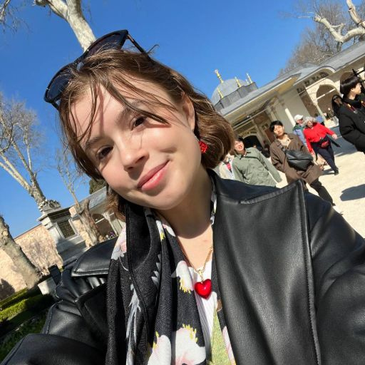
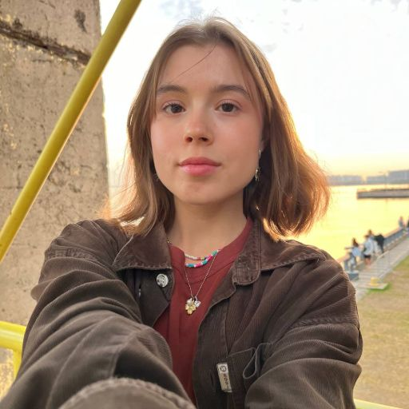
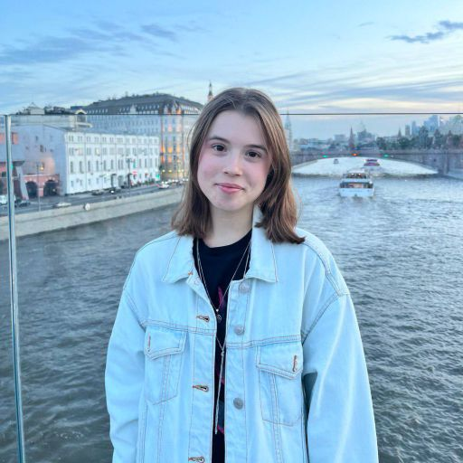
</p>
<p>
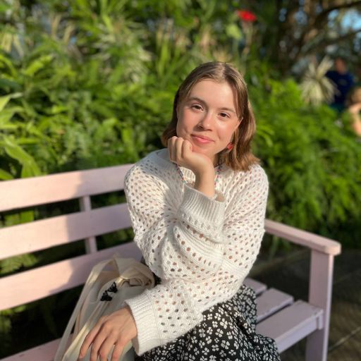
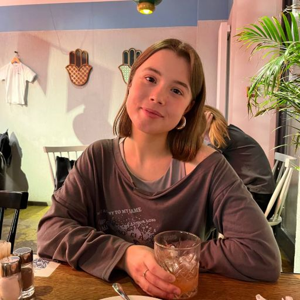

</p>
Таблица 1. Пример изображений для обучения


### Скачивание и конвертация чекпоинта
Скачайте чекпоинт с помощью следующей команды:
```bash
bash download_and_convert.sh
```

После этого в вашей директории `./cache_dir/models` должна появиться папка `civitai_model`.


### Обучение SD 1.5
В качестве базовой модели обучила SD1.5 с такими параметрами:
```
exp1.1

--with_prior_preservation 
--prior_loss_weight=1.0
--resolution=512
--train_batch_size=1
--learning_rate=2e-6
--lr_scheduler="constant"
--lr_warmup_steps=0
--gradient_accumulation_steps=1
--num_class_images=500
--max_train_steps=800
--checkpointing_steps=800
--use_8bit_adam
--mixed_precision="no"
--train_text_encoder
--seed 31
```
Буду сравнивать такие промпты:

`prompt1` : portrait of sks woman face, on the street, lights, midnight, NY, standing, 4K, raw, hrd, hd, high quality, realism, sharp focus,  beautiful eyes, detailed eyes

`prompt2` : portrait of sks woman face, in the desert, wearing a dress, sun, pyramids, сamels, Egypt, standing, standing alone, 4K, raw, hrd, hd, high quality, realism, sharp focus,  beautiful eyes, detailed eyes

`prompt3` : portrait of sks woman face, in the game of thrones, wearing a dress, holding a knife, standing aside, dragons nearby, lord jojn snow holding hands with her, 4K, raw, hrd, hd, high quality, realism, sharp focus,  beautiful eyes, detailed eyes

`prompt4` : portrait of sks woman face, cinderella, in the princess castle with rainbow, full height, crying, cartoon, 4K, raw, hrd, hd, high quality, sharp focus

`prompt5` : a face of sks woman, astronaut, moon, space, full height, 4K, raw, hrd, hd, high quality, sharp focus

Результаты получились такие:


| exp      | `prompt1` | `prompt2` | `prompt3` | `prompt4` | `prompt5` |
|----------|----------|----------|----------|----------|----------|
| `exp1.1` |  |  |  | 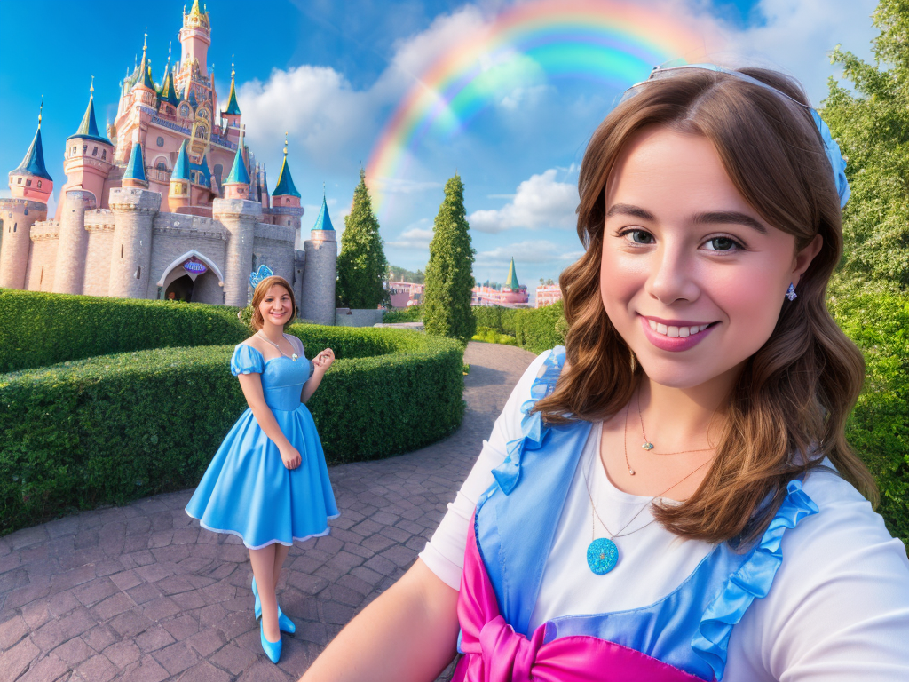 | 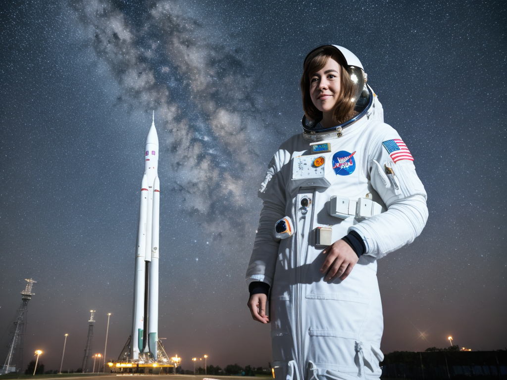 |
| `exp2` | 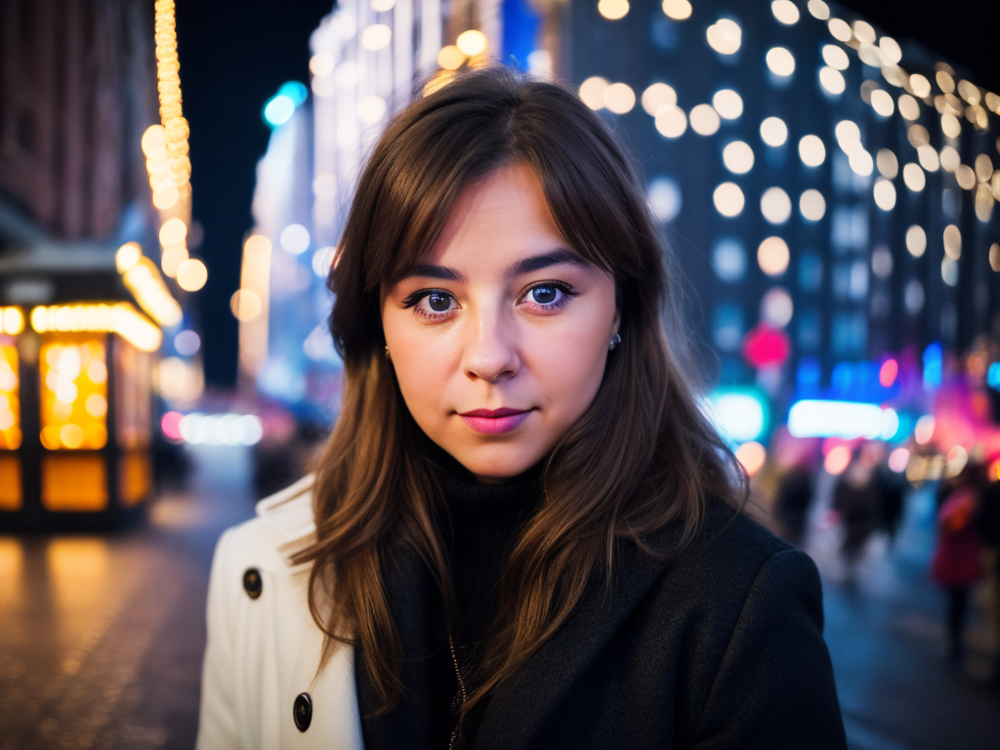 | 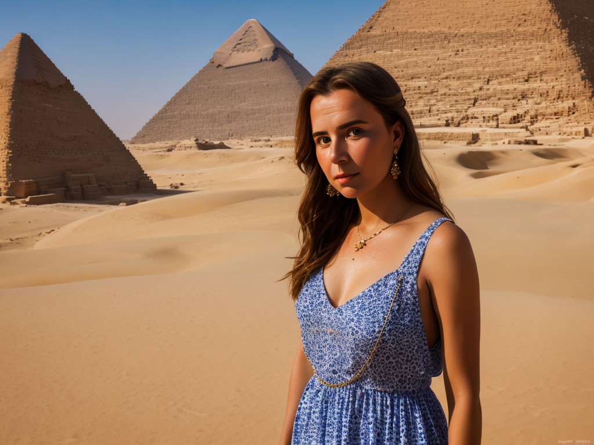 | 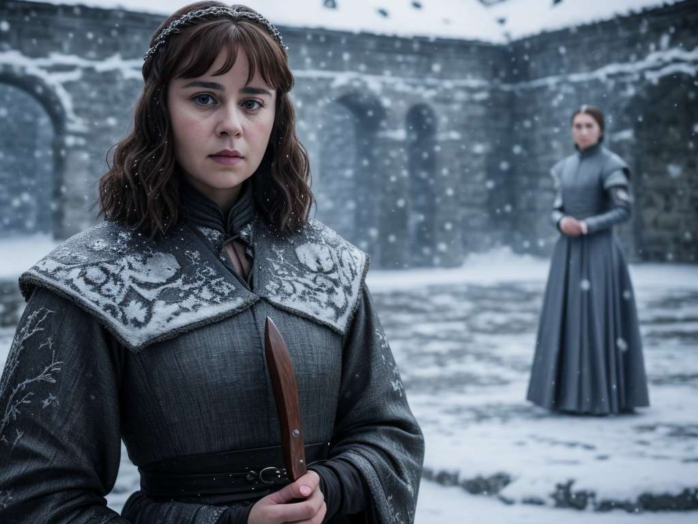 | 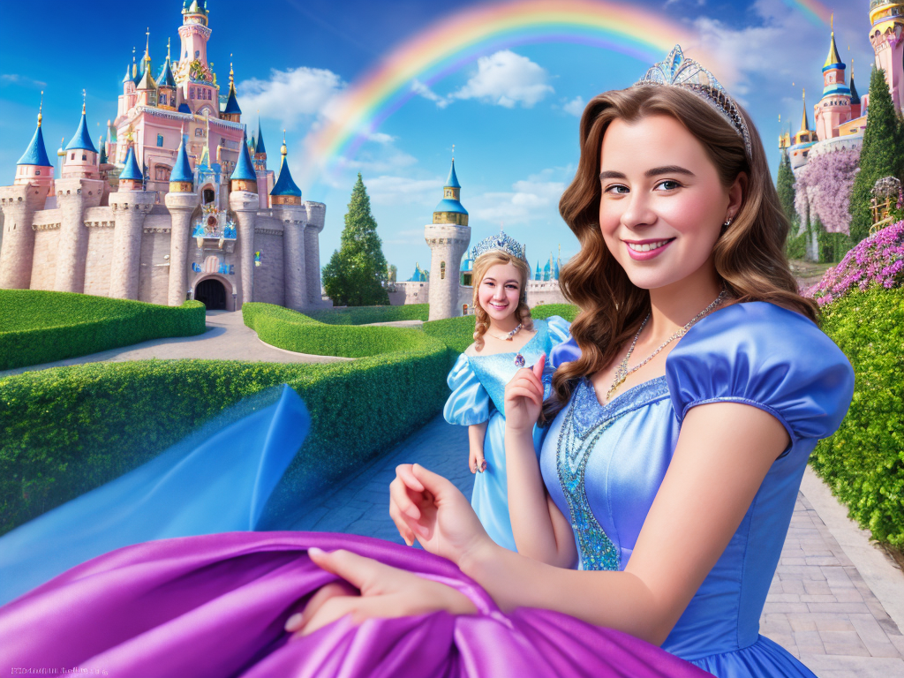 | 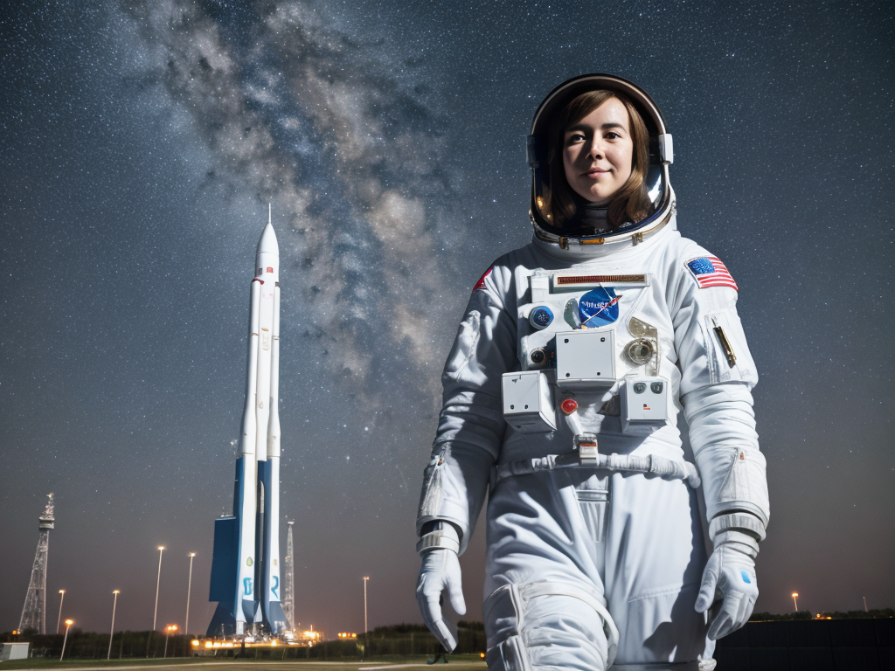 |
| `exp3` |  | 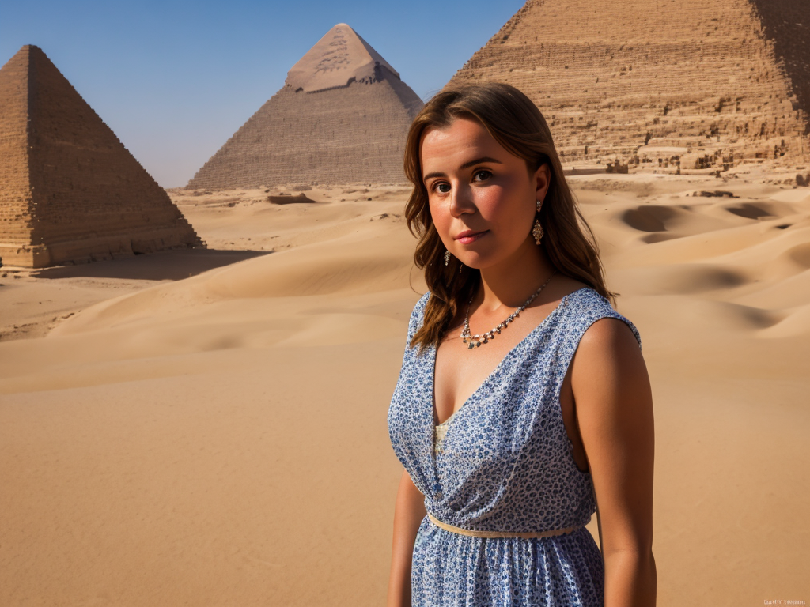 | 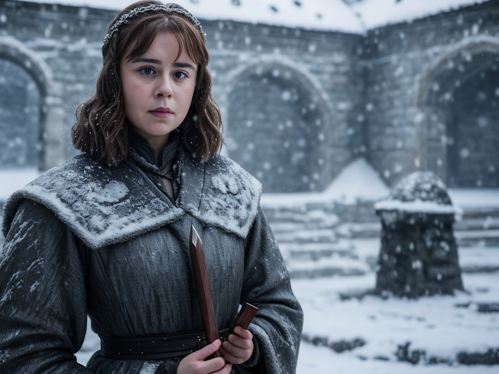 | 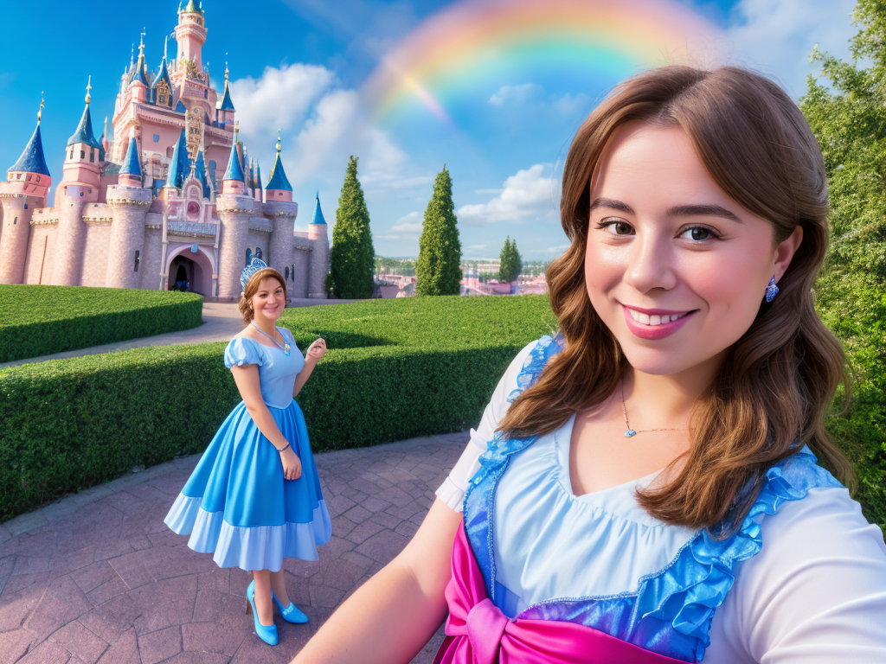 | 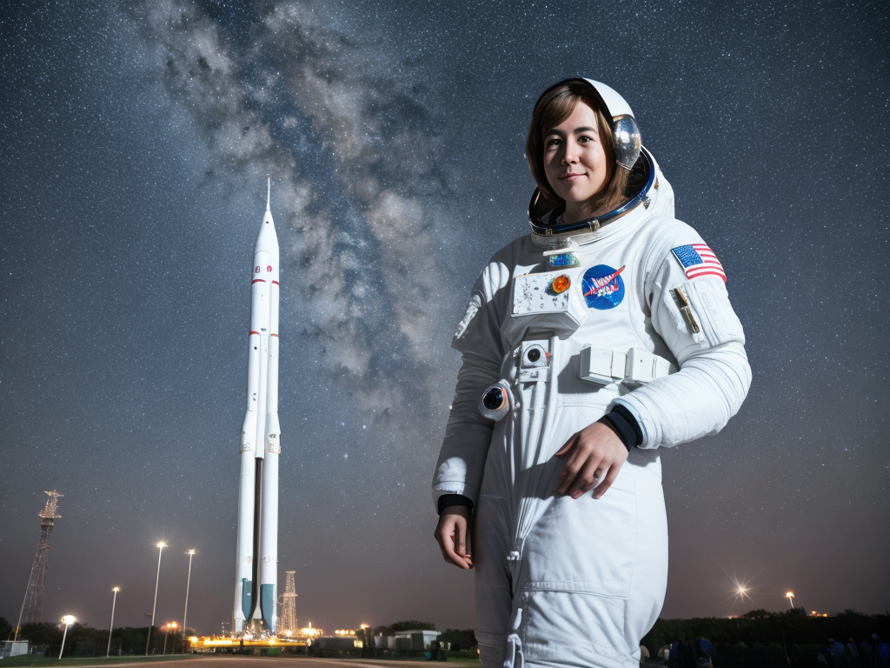 |

Планирую еще попробовать другие параметры и сделать остальные пункты.