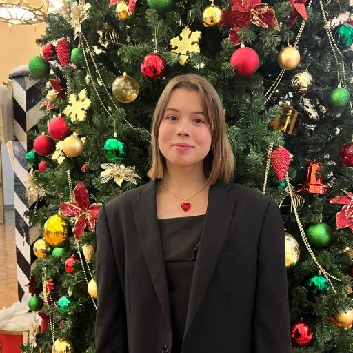
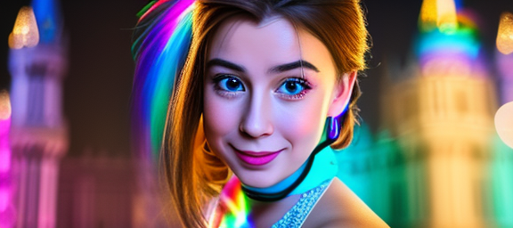

# ДЗ 4. Обучение Stable diffusion 1.5 методом Dreambooth

Выполнила Горохова Александра Сергеевна

### 1. Окружение

```bash
git clone https://github.com/TimDettmers/bitsandbytes.git
```

Создайте окружение в anaconda3:
```bash
conda env create -f environment.yml
conda activate genmodels
```

```bash
cd bitsandbytes
python setup.py install
cd ..
git clone https://github.com/huggingface/diffusers
pip install git+https://github.com/huggingface/diffusers
```

После этого можете проверить корректность установки:
```bash
python check_env.py
```

Вывод должен быть примерно таким:
```
PyTorch version: 2.7.0+cu126
CUDA available: True
CUDA version: 12.6
cuDNN version: 90501
Accelerator initialized successfully!
```

### 2. Датасет
Для обучения я решила взять 21 свою фотографию за последний год, на фото есть как ближний, так и средний план.

Все фото расположены в `data/instance_images/`

Все фото были обрезаны и приведены к размеру 512x512.

<p>


</p>
<p>



</p>
Таблица 1. Пример изображений для обучения


### Скачивание и конвертация чекпоинта
Скачайте чекпоинт с помощью следующей команды:
```bash
bash download_and_convert.sh
```

После этого в вашей директории `./cache_dir/models` должна появиться папка `civitai_model`.


### Обучение SD 1.5
В качестве базовой модели обучила SD1.5 с такими параметрами:
```
--pretrained_model_name_or_path=$MODEL_NAME \
--instance_data_dir=$INSTANCE_DIR \
--class_data_dir=$CLASS_DIR \
--output_dir=$OUTPUT_DIR \
--instance_prompt="a photo of sks woman face" \
--class_prompt="a photo of woman face " \
--with_prior_preservation 
--resolution=512 \
--train_batch_size=1 \
--lr_scheduler="constant" \
--lr_warmup_steps=0 \
--gradient_accumulation_steps=1 \
--num_class_images=500 \
--max_train_steps=800 \
--checkpointing_steps=800 \
--use_8bit_adam \
--mixed_precision="no"\
--train_text_encoder \
--seed 31
```
Буду сравнивать такие промпты:

`prompt1` : portrait of sks woman face, on the street, lights, midnight, NY, standing, 4K, raw, hrd, hd, high quality, realism, sharp focus,  beautiful eyes, detailed eyes

`prompt2` : portrait of sks woman face, in the desert, wearing a dress, sun, pyramids, сamels, Egypt, standing, standing alone, 4K, raw, hrd, hd, high quality, realism, sharp focus,  beautiful eyes, detailed eyes

`prompt3` : portrait of sks woman face, in the game of thrones, wearing a dress, holding a knife, standing aside, dragons nearby, lord jojn snow holding hands with her, 4K, raw, hrd, hd, high quality, realism, sharp focus,  beautiful eyes, detailed eyes

`prompt4` : portrait of sks woman face, cinderella, in the princess castle with rainbow, full height, crying, cartoon, 4K, raw, hrd, hd, high quality, sharp focus

`prompt5` : a face of sks woman, astronaut, moon, space, full height, 4K, raw, hrd, hd, high quality, sharp focus

Описание экспериментов:
| exp      | гиперпараметры |
|----------|----------|
| `exp1.1` | `prior_loss_weight=1.0`, `lr=2e-6` | 
| `exp2` | `prior_loss_weight=1.0`, `lr=1e-6` | 
| `exp3` | `prior_loss_weight=1.2`, `lr=2e-6` | 

Результаты:


| exp      | `prompt1` | `prompt2` | `prompt3` | `prompt4` | `prompt5` |
|----------|----------|----------|----------|----------|----------|
| `exp1.1`|  |  |  |  |  |
| `exp2` |  |  |  |  |  |
| `exp3` |  |  |  |  |  |

Наиболее удачным получился `exp1.1`, изменение `lr` и `prior_loss_weight` не сказалось положительно на похожести генераций на настоящие фото.
Однако все же увеличение `prior_loss_weight` сделало генерации более реалистичными и помогло избавиться от некоторых артефактов.

Девушка в генерации по пятому промпту не выглядит вообще похожей на меня, возможно дело в том, что в предоставленных мною изображений не было фото в полный рост, где лицо было бы видно хуже. Поэтому в этой генерации скорее доминируют знания модели о мире.

### Обучение LORA

Общие параметры обучения для экспериментов:
```
--pretrained_model_name_or_path="./experiments/exp1_v1" \
--instance_data_dir=$INSTANCE_DIR \
--instance_prompt="a photo of sks woman face" \
--resolution=512 \
--train_batch_size=1 \
--gradient_accumulation_steps=1 \
--learning_rate=1e-6 \
--lr_scheduler="constant" \
--lr_warmup_steps=0 \
--max_train_steps=200 \
--checkpointing_steps=20 \
--use_8bit_adam \
--mixed_precision="no"\
--train_text_encoder \
--validation_prompt="a photo of sks woman face in NYC, rain, dark, night, full moon, 4K, raw, hrd, hd, high quality, realism, sharp focus, beautiful eyes, detailed eyes" \
--validation_epochs=50 \
--seed=31 \
```

Описание экспериментов:
| exp      | гиперпараметры |
|----------|----------|
| `exp1.1` | `rank=32` | 
| `exp2` | `rank=64` | 
| `exp4` | `rank=96` | 

Результаты:

| exp      | `prompt1` | `prompt2` | `prompt3` | `prompt4` | `prompt5` |
|----------|----------|----------|----------|----------|----------|
| `exp1.1`|  |  |  |  |  |
| `exp2`|  |  |  |  |  |
| `exp4`|  |  |  |  |  |

Между генерациями небольшие отличия, так как видимо была хорошая предобученная модель. Однако лучше всего все же получились генерации при самом большом `rank` = 96. Генерация с `rank` = 32 мало отличается от лучшего эксперимента Unet. В таком случае можно сделать вывод, что глубина модели положительно влияет на качество генерации.

### Сравнение LORA и Unet
Выбрала лучшую генерацию Unet  - это `exp1.1`, и Lora - `exp4`. Сравнение генераций:

| exp      | `prompt1` | `prompt2` | `prompt3` | `prompt4` | `prompt5` |
|----------|----------|----------|----------|----------|----------|
| Unet best|  |  |  |  |  |
| Lora best|  |  |  |  |  |

Видим, что все же эксперимент с Lora имеет более качественные генерации.

### Controlnet

Контрольное изображение:


Попробовала различные варианты Controlnet для пяти промптов. Результаты:


| exp      | `prompt1` | `prompt2` | `prompt3` | `prompt4` | `prompt5` |
|----------|----------|----------|----------|----------|----------|
| canny|  |  |  |  |  |
| depth|  |  |  |  |  |
| pose|  |  |  |  |  |

- `canny` - подгоняет черты лица, его форму, волосы под контрольное изображение
- `depth` - как будто бы больше переносит перспективу и соотношение объектов контрольного изображения на генерации
- `pose` - в большей степени подгоняет позу в генерации под позу контрольного изображения

Во всех случаях начинает страдать сама генерация, появляется больше артефактов.
